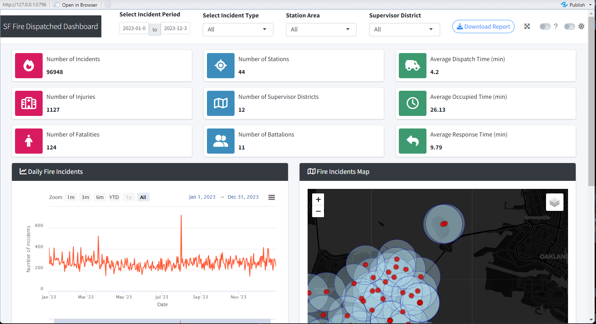

# Analysis of Public Fire Incident Dispatch Data in San Francisco
## In-Depth Data Analysis and Creation of a Dashboard

Fire and medical response teams are key contributors to emergency responses. Due to the continuous increase in emergency situations, they are experiencing significant bottlenecks that affect response times, despite efforts to optimize available resources. Large and modern cities are continuously refining their emergency plans for medical and fire services to ensure the safety of their citizens.

The San Francisco (SF) Fire Department is the first respondent to medical and fire incidents across the SF region. Today, the department serves over 1.5 million residents, continuing a legacy of more than 150 years of dedicated services(Department 2024).The fire department maintains a dataset that includes a daily updated record of fire and ambulance calls in the city.
This dataset provides a comprehensive overview of the volume and distribution of medical and fire incidents across San Francisco.

The purpose of this project is to analyze and understand the operations of the San Francisco (SF) Fire Department and evaluate its performance. Therefore in-depth analysis has been performed under the three research questions.

**Research Question 1** - How do crime incidents influence the occurrence of fire and Emergency Medical Service(EMS) incidents in San Francisco?

**Research Question 2** - How does seasonal temperature variation influence the occurrence of fire incidents in San Francisco?

**Research Question 3** - How effective are fire stations in reaching the highest fire incident locations within optimal response times, as analyzed through isochrone mapping?

### Dashboard 
A dashboard is created using the R Shiny package to visualize and interact with the datasets and the analysis. The dashboard offers different filtering methods and real-time data exploration. The dashboard is designed to interact with users’ input and responses by providing graphs, tables, maps, patterns of fire incidents and relevant data instantly.

